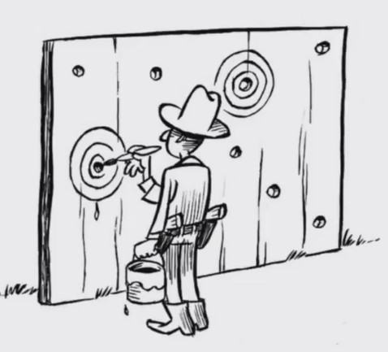
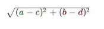
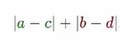

# Introducción al pensamiento probabilistico


<div align="center"> 
  
</div>

Tabla de Contenidos
=================

   * [Programación probabilistica](#programacion-probabilistica)
      * [TEOREMA DE BAYES](#teorema-de-bayes)
   * [Mentiras estadisticas](#mentiras-estadisticas)
      * [Garbage in, garbage out (GIGO)](#garbage-in-garbage-out-gigo)      
      * [Imagenes engañosas](#imagenes-enga\xC3\xB1osas)
      * [Cum Hoc Ergo Propter Hoc (<em>latin</em>)](#cum-hoc-ergo-propter-hoc-latin)
      * [El prejuicio del muestreo](#el-prejuicio-del-muestreo)
      * [Falacia del francotirador de Texas](#falacia-del-francotirador-de-texas)
      * [Porcentajes confusos](#porcentajes-confusos)
      * [Falacia de regresión](#falacia-de-regresi\xC3\xB3n)
   * [INTRODUCCION A MACHINE LEARNING](#introduccion-a-machine-learning)
      * [Feature Vectors](#feature-vectors)
      * [Métricas de Distancia.](#m\xC3\xA9tricas-de-distancia)
   * [AGRUPAMIENTO](#agrupamiento)
      * [Introducción al agrupamiento (<em>clustering</em>)](#introducci\xC3\xB3n-al-agrupamiento-clustering)
      * [Agrupamiento jerárquico.](#agrupamiento-jer\xC3\xA1rquico)

   * [AGRUPAMIENTO](#agrupamiento)
      * [Introducción al agrupamiento (<em>clustering</em>)](#introducci\xC3\xB3n-al-agrupamiento-clustering)         

      * [Agrupamiento jerárquico.](#agrupamiento-jer\xC3\xA1rquico)
      * [Agrupamiento K-means](#agrupamiento-k-means)
      * [Otras técnicas de agrupamiento.](#otras-t\xC3\xA9cnicas-de-agrupamiento)
         * [Tipos de agrupamiento](#tipos-de-agrupamiento)
         * [Modelos para determinar similitudes](#modelos-para-determinar-similitudes)
         
Table of Contents Created by [gh-md-toc](https://github.com/ekalinin/github-markdown-toc)

# Programacion probabilistica

## TEOREMA DE BAYES
```
         P(A) P(B|A)
 P(A|B)= ----------
           P(B)
```
Probabilidad de A (Hipotesis) dado B (evidencia)


# Mentiras estadisticas

## Garbage in, garbage out (GIGO)
Son como un tercer nivel de errores donde tenemos
- 1 Errores de sintaxis
- 2 Errores de lógica
- 3 Errores de (diseño y modelado del programa)

GIGO solo nos dice que si la calidad de nuestros datos es igual de fundamental que la precisión de nuestros computos

En otras palabras con datos errados las conclusiones serán erradas.


 *Ejemplo*
> Los censos en su principio tenian muchisimos errores, y uno de los errores mas importantes es que se llego a la conclusión de que una persona de color que era libre tenian 10% más probabilidad de volverse locos que los esclavos. Sin embargo esto no era cierto, debido a que los censos eran incorrectos.

*Otro ejemplo* aporte de Juan Moreno

> Una historia común sobre muestreo es el caso de los aviones aliados en la Segunda Guerra Mundial. Lo que pasó era que veían que los aviones de combate que regresaban, usualmente tenían muchas averías e impacto de proyectiles en las alas y otras áreas. Lo que pensó la RAF fue observar donde estaban los huecos, hacer un analisis de las zonas más afectadas en sus aviones y empezar a mandar los aviones reforzados en esas zonas. ¿El problema? su muestra eran aviones que sí regresaban de combate, por lo que Abraham Wald les hizo ver que si los aviones regresaban con huecos en esas partes, era porque en esas partes los impactos no eran letales y al contrario de lo que decían los datos, había que reforzar las  partes del avión que no habian sido afectadas.

## Imagenes engañosas
Un error o metodo de engaño es:
>Extrapolar las conclusiones erroneas despues de ver una imagen.

- Cuando se juega con la escala de la grafica se puede llegar a conclusiones incorrectas.


Podemos ver que nos da una perspectiva distinta al comparar con una escala adecuada.

- **Nunca debes confiar en una gráfica sin etiquetas.**


## Cum Hoc Ergo Propter Hoc (*latin*)
Lo primero que necesitamos entender es que la correlacion entre dos variables sólo significa que ambas se mueven en el mismo sentido cuando se trata de una correlacion *positivo* o *negativa* cuando se mueven en direcciones opuestas. Pero recuerda
> Correlación no implica causalidad

La frase en latín *Cum Hoc Ergo Propter Hoc* en español significa:

*Despues de esto, eso; Entonces a consecuencia de esto, eso.*

Pero no te cases con una sola causa, piensa ***out of the box***, imagina que otras causas pueden hacer que suceda cierto hecho, para no caer en conclusiones erroneas.


 
## El prejuicio del muestreo
Aspectos importantes que seguir para el muestreo.
 - Para que un muestreo pueda servir como base para la inferencia estadistica tiene que ser:
   - **Aleatorio**
   - **Representativo.**
 - El prejuicio en el muestreo elimina la representatividad de las muestras.
 - A veces conseguir muestras es difícil, por lo que se utiliza a la población de más fácil acceso (caso estudios universitarios)

*Ejemplo*

> La mayoria piensa que los primeros seres humanos en la era de la prehistoria, siempre vivian en cavernas. Sin embargo esto no es totalmente cierto ya que no todos vivían en cavernas, sin embargo es lo que encontramos en las cuevas lo que nos ayudó a entender a esta civilización. 
Asi que podemos decir que la muestra era posiblemente aleatoria pero no era representativa.


*El error de muestreo provoca que los resultados o conclusiones puedan estar sesgados.*

## Falacia del francotirador de Texas

Esta falacia se da cuando no se toma la aletoriedad en consideración
- También sucede cuando uno se enfoca en la similitudes e ignora las diferencias
- Cuando fallamos al empezar a recolectar datos antes de generar una hipotesis estamos en alto riesgo de caer en esta falacia (muy común en Data Science)




La falacia del francotirador consiste en primero disparar y posteriormente pintar los blancos.

En otro contexto podemos decir que empezamos a obtener las muestras y despues la hipotesis se adapta a los datos recolectados, lo cual no debería ser así.

*Ejemplo*

Cuando ignoramos parte de los datos, como por ejemplo enfocarnos unicamente en las veces que le fue bien a un emprendedor e ignorar las veces que le fue mal y concluir que es un gran emprendedor porque a una le fue bien.

Evita caer en el error de ver primero los datos y concluir algo al respecto, en lugar de generar una hipotesis, recolectar muestras de manera aleatoria y representativa para posteriormente concluir adecuadamente.

## Porcentajes confusos

La mentira a través de los porcentajes puede suceder cuando:

- No sabemos la cuenta total de la cual se obtiene un porcentaje.
- No tenemos un contexto claro
- Existen porcentajes en vacío

*Ejemplo*

> ¿Cual escuela tuvo el mejor desempeño global?
> - Escuela A - incremento su rendimiento en 25%
> - Escuela B - incremento su rendimiento en 10%
> - Escuela C - incremento su rendimiento en 5% 


Ahora con contexto, ¿Cual escuela realmente alcanzó un mejor desempeño?.

|  | Rendimiento 2018 | Rendimiento 2019 | Incremento  | Incremento porcentaje |
| :---         | :---:      |  :---: |:---:      |  :---: |
| Escuela A   | 20     |  25    | 5 | 25% |
| Escuela B   | 50   | 55  | 5 | 10 % |
| Escuela C   | 95   | 100  | 5 | 5 % |

Ejemplo 2
> **¡La excusa del borracho que maneja!**
Argumentando que estadísticamente es más probable que choque si va sobrio a que si va borracho. ya que el 70% de los accidentes son por personas sobrias y el 30% por personas borrachas.


## Falacia de regresión

Esta falacia sucede cuando atribuimos efectos de causalidad a eventos que simplemente suceden por regresión a la media. 

*Ejemplo*

>Como cuando un deportista tiene su peor racha en la liga y el entrenador lo regaña o castiga para que mejore, posteriormente el deportista ya no la riega tan feo. Sin embargo esto sucede porque tiende a la media, a su juego normal, no porque el entrenador haya aplicado la medida correcta.

Esta falacia ocurre unicamente  cuando los eventos fluctuan 

# INTRODUCCION A MACHINE LEARNING

¿Que es?

> Es el campo de estudio que le da a las computadoras la habilidad de aprender sin ser explícitamente programadas.
> - Artur Samuel, 1959

Machine Learning no es TERMINATOR. Son algoritmos que se utilizan principalmente en la detección de patrones.


Todo comienza con el **TEOREMA DE BAYES**.
Nos enseña como incorporar la evidencia y los datos que obtenemos del mundo real de una forma cada vez más correctas.


*Posteriormente*, Alan Turing nos otorgó una forma de ver a los algoritmos como el mismo algoritmo (**maquinas de turing**), dando la base de las computadoras modernas. Sino tambien las bases para que las computadoras pudieran aprender.


*Años despues* llega Marvin Minsky, quien logra crear la **primera red neuronal**, cuando en el año de 1951 las computadoras ocupaban cuartos completos con memoria super limitada. Sin embargo ya era demostrable que las computadoras pudieran aprender.


Y en *1952* Arthur Samuel genera el **primer programa que sabe jugar damas chinas**, y lo genera calculando los siguientes movimientos. Este programa nos permitio entender que aprender desde una perspectiva humana era:
- Memorizar
- Generalizar

Por lo que los algoritmos basicamente recuerdan lo que han visto y en otras ocasiones generalizan esta información.


En *1957* Frank Rosenblatt **inventa el perceptron**, que podía reconocer digitos escritos a mano y convertirlos en una representación computacional.


*En 1963 Donald Michie* crea la **primera red adversarial** que permite que las computadoras puedan jugar constantemente para entender como automatizar las reglas de un juego. TIC TAC TOE


*En 1969 Marvin Minsky* escribe el **libro de perceptron** donde se recolecta toda la investigación relacionada con redes neuronales. Deteniendo la investigación en inteligencia artificial por casi 20 años al pensarse que no podía llegar a desarrollarse más.


*En el año 1997* fue el año en que la computadora Deep Blue de IBM derrota al actual campeón de ajedrez del mundo, Gary Kaspárov. Que marcó el pasó hacia la inteligencia artificial moderna.


*En el 1998* se libera el dataset mnist, que aún hoy en día se sigue utilizando como el hello world de machine learning, ya que se toma este dataset con muchisimos digitos escritos a mano junto con las etiquetas de estos digitos, de tal forma que se pudieran potencializar los algoritmos que cada vez podían utilizar computo de mayor y mayor escala, aprovechando la Ley de Moore.


*En 2009* Fei Fei Li una investigadora de estanford libero el dataset imagenet, una de las más grandes contribuidoras en el campo de la inteligencia artificial y que lideró la inteligencia artificial dentro de google. A partir de su liberación la inteligencia artificial mejoró y crecio el campo en esta areá para lograr muchas de las cosas que vemos hoy en día.


*En el año 2011* la computadora Watson de IBM que jugaba Jeopardy, derrotó a dos de los más grandes jugadores utilizando, redes neuronales, reconocimiento de patrones y retrieval de información( acceso a la información de manera muy rapida). Demostrando que las computadoras, aún en juegos muy abstractos podían derrotar a los grandes campeones del mundo.


*En el año 2012* youtube tenía gran cantidad de videos en su información, Google lográ procesar con toda su infraestructura toda la data para encontrar gatos en los videos.
*En el 2014* implemento su algoritmo de reconocimiento facial y justamente en ese año fue cuando comenzamos a ver que podíamos etiquetar, y aún en imagenes que no nos habian etiquetado, podían detectar que nosotros apareciamos ahí.


*En el 2016* el algoritmo alpha go de google, derroto al respectivo campeon del mundo en el juego go. Uno de los juegos con más posibilidades y mayor demanda.


Finalmente, para concluir debemos entender que Machine Learning se utiliza cuando:
- Programar un algoritmo es muy complejo o no se conocen algoritmos para resolverlo
- Ayuda a los humanos a entender patrones(data mining)

Existe: 
- Aprendizaje supervisado (etiquetado)
- Aprendizaje no supervisado
- Aprendizaje semisupervisado

Tambien existen tecnicas:
 - Batch (Se genera una vez y se aplica)
 - online learning (Se va actualizando constantemente conforme entran datos.)

## Feature Vectors
Se utilizan para representar caracteristicas simbólicas o numéricas llamdas features, ya que nos permiten analizar un objeto desde una perspectiva matemática, debido a que los algoritmos de machine learning típicamente necesitan representaciones numéricas para poder ejecutar el cómputo.

Basicamente cada vector puede contener n caracteristicas, y si lo vemos desde la perspectiva de la programación, un vector es un arreglo, donde cada elemento es una caracteristica que representa un valor.

Sin embargo no es una tarea fácil definir que caracteristicas se deben vectorizar, ya que debemos tener en cuenta varios aspectos como es el peso, importancia, la forma correcta de definirlos, etc. Así que la verdadera tarea del computer scientist es analizar adecuadamente el problema para ver que es lo que importa y lo que no importa.

***Ejemplo RGB***

Uno de los feature vectores más utilizados, es la representación del color a través de RGB. Bastante utilizado en el área de Disseño y Desarrollo Web para representar colores. que normalmente para definir un color unicamente se hace valer de tres **caracteristicas**: 
   - color = [Red,Green,Blue]
Donde cada valor, va de 0 a 255, esto nos permite describir millones de colores unicamente con esas tres.

   


 ***En procesamiento de imágenes:***
  - Gradientes
  - Border
  - Áreas
  - Colores 
  - Escalas de grises.

 ***En reconocimiento de voz:***
  - Distancia de sonidos.
  - Nivel de ruido.
  - Razón entre el ruido y la señal.
  - Longitud de onda.

 ***En SPAM:***
  - Frecuencia de palabras
  - IP del correo
  - Header
  - Estructura del texto

Lo importante es entender que para poder aplicar los algoritmos de machine learning, debemos poder entender vectores relevantes para el problema que se quiere resolver.

## Métricas de Distancia.
Las métricas de distancia nos permiten clasificar que tan cercanos o lejanos están los vectores que nosotros estamos incorporando directamente al algoritmo.

Muchos de los algoritmos de machine learning pueden clasificarse como **algoritmos de optimización**, donde lo que principalmente se desea optimizar es una función que en muchas ocasiones se refiere a la **distancia entre vector features**.

Imaginemos dos vectores **X**  y  **Y**:

*x  =  (a,b)*            
*y  =  (c,d)*

Entonces para sacar la distancia podemos hacer uso de diferentes formas de medir distancia:

- la distancia euclidiana.


- Distancia de Manhattan



- otros metodos para sacar distancia. 
  - https://journals.plos.org/plosone/article?id=10.1371/journal.pone.0144059 
  - https://docs.scipy.org/doc/scipy/reference/spatial.distance.html


# AGRUPAMIENTO

## Introducción al agrupamiento (*clustering*)
El agrupamiento simplemente es una forma más para poder clasificar los algoritmos de machine learning, y de hecho es una de las más comunes para clasificarlos.

Los **algoritmos de _clustering_** nos permiten entender la estructura interna de los datos, sin necesidad de utilizar etiquetas. 
Además, nos permiten agrupar cada uno de nuestros datos en diferentes grupos o *clusters* para ver que tan similares o diferentes son los datos.

Cabe mencionar que a este tipo de algoritmos también se le conocen como algoritmos no supervisados ya que no requeiren etiquetas.

Este tipo de algoritmos es muy utilizado en motores de recomendación, análisis de redes sociales, análisis de riesgo crediticio, clasificación de genes, riesgos médicos, motores de busqueda, etc.


***Referencias para profundizar***
- https://towardsdatascience.com/the-5-clustering-algorithms-data-scientists-need-to-know-a36d136ef68


## Agrupamiento jerárquico.
Es un algoritmo sencillo que simplemente agrupa objetos similares en grupos llamados clusters. 

El algoritmo comienza tratando a cada objeto como un cluster individual, lugeo realiza los siguientes pasos de manera recursiva, revisando las relaciones entre sus objetos:
- identifica los dos clusters con menos distancia( los más similares a él)
- Agrupa los dos clusters en uno nuevo.

La salida final es un dendograma que muestra la relación entre objetos y grupos.


Finalmente para llevarlo a cabo es importante determinar qué medida de distancia vamos a utilizar y los puntos a utilizar en cada cluster( *linkage criteria*). Para ello existen 3 diferentes metodos para medir la distancia.
- ***Single linkage***, es tomar los puntos más cercanos.
- ***Complete linkage*** , es tomar los puntos más lejanos (entre grupos)
- ***Average Linkage***, buscar los puntos promedio de cada grupo.

***Referencias para profundizar***
- https://www.instintoprogramador.com.mx/2019/07/clustering-jerarquico-con-python-y.html
- Implementación propia del [algoritmo de jerarquico en python](https://github.com/BralexMtz/Introduccion-al-pensamiento-probabilistico/blob/main/Agrupamiento%20Jerarquico/hierarchical-clustering.py)

## Agrupamiento K-means
Es un algoritmo que agrupa utilizando centroides.

El algoritmo funciona asignando puntos al azar(K define el número inicial de clusters) y después:
*  En cada iteración el punto se ajusta a su nuevo centroide y cada punto se recalcula con la distancia con respecto de los centroides.
* Los puntos se reasignan al nuevo centro.
* El algoritmo se repite de manera iterativa hasta que ya no existen mejoras.

*Otra explicación del algoritmo*

**Algoritmo k-Means**
1. Seleccionar el **número de k grupos** (*clusters*)
2. **Generar aleatoriamente k puntos** que llamaremos *centroides*.
3. **Evaluar la distancia** entre cada elemento del conjunto de datos y los centroides.
4. **Asignar el elemento al centroide** más cercano para formar k grupos.
5. **Reasignar la posición de cada centroide**, obteniendo promedio de coordenadas.
6. **Reasignar los elementos de datos al centroide** más cercano nuevamente
    * Si hubo elementos que se asignaron a un **centroide distinto al original**, regresar al paso **5**
    * De lo contrario, **el proceso ha terminado**


Este algoritmo como ya sabemos nos agrupa datos en diferentes clusters, de tal forma que al terminar podemos visualizar k grupos. 

Por lo tanto si tenemos un nuevo dato, simplemente nos queda visualizar en que lado está. 


Sin embargo, hay varias consideraciones:
* Escoger un k que sea el más adecuado, dado que podemos generar los que sean, pero no todos van a agrupar los datos correctamente.

    - Para ello debemos entender perfectamente el dominio del problema que estamos tratando de resolver, debido a que nos podra dar intuiciones sobre el numero de *k* correctos.
* Es computacionalmente pesado hacerlo con una cantidad de datos enorme.

    - Asi que debemos hacer muestreo representativos para no tener que hacer todos los calculos.


***Referencias para profundizar***
- https://www.jacobsoft.com.mx/es_mx/k-means-clustering-con-python/
- http://www.it.uc3m.es/~jvillena/irc/practicas/08-09/06.pdf
- http://www.it.uc3m.es/~jvillena/irc/practicas/08-09/06.pdf
- https://platzi.com/clases/1621-data/21041-como-funciona-el-algoritmo-k-means/ 
- https://www.youtube.com/watch?v=N1-eWwsM8NE

## Otras técnicas de agrupamiento.

El agrupamiento es una técnica de Machine Learning que nos sirve para dividir un set de datos en grupos. De tal manera que podamos visualizar elementos similares entre los elementos del mismo grupo.

### Tipos de agrupamiento

Existen dos tipos de agrupamiento:
* **Agrupamiento estricto(hard clustering)**: cada dato pertenece a un grupo u otro.
* **Agrupamiento laxo(soft clustering)**: en lugar de asignar un dato a un grupo, se asignan probabilidades de pertenecer o no a un grupo.

 Es importante analizar las necesidades que nos plantea el problema con el fin de escoger el algoritmo más adecuado.

 ### Modelos para determinar similitudes
En general existen 4 aproximaciones para definir similitud:
 * **Modelos conectivos**: asumen que los puntos similares son los que se encuentran más cercanos en el espacio de búsqueda.  Una desventaja es que este tipo de modelos no escalan para grandes conjuntos de datos. Aunque se puede hacer uso de la *estadística inferencial*.
 * **Modelos de centroide**: definen similitud en términos de cercanía con el centroide del grupo. Los datos se agrupan al determinar cuál es el centroide más cercano.
 * **Modelos de distribución**: Trata de asignar probabilidades a cada dato para determinar si pertenecen a una distribución específica o no.
 * **Modelos de densidad**: Analizan la densidad de los datos en diferentes regiones y dividen el conjunto en grupos, luego asignan los puntos de acuerdo a las áreas de densidad en las que se haya dividido el dataset.

 No obstante es importante recordar que no sé trata de cuál es el mejor modelo, ya que muchas de las mejores soluciones se hacen a partir de varios modelos, para analizar el rendimiento de los diversos algoritmos que tienen a su dispocisión, experimentando y comparando resultados.

# Clasificación 


## Introducción a la clasificación 

El agrupamiento es un tipo de **aprendizaje no supervisado**, ya que muchas veces no sabemos de que manera se van a agrupar, y por lo tanto no viene etiquetado.

Por otro lado la clasificación si necesita de estás etiquetas(*labels*), por lo que se denomina un aprendizaje **supervisado**.
Se utiliza en muchos campos como la medicina, aprobación, crediticia, reconocimiento de imágenes, vehículos autónomos, entre otros.

Para poder realizar un algoritmo de clasificación basicamente se necesitan 2 pasos.
* **Aprendizaje** : creación del modelo a partir de un dataset
* **Clasificación**: de un dato nuevo sin etiqueta


**NOTA**: Tambien existe el aprendizaje semisupervisado, como por ejemplo *google fotos* cuando a partir de lo que tu le dices cierta información, se puede clasificar los demás.

Otra diferencia importante entre el agrupamiento y la clasificación se ve en la siguiente imagen.


En la imagen podemos ver que el clustering es separa los datos en clusters o regiones, mientras que la clasificación lo hace a partir de lineas rectas o curvas que atraviesan el espacio.

## Clasificación K-nearest neighbors

Es uno de los algoritmos más importantes y antiguos.dentro del mundo del Machine Learning.

Partimos suponiendo que ya tenemos un conjunto de datos clasificados y queremos saber cual es la etiqueta o clasificación de un nuevo dato. 

Se llama *K-nearest neighbors* porque tratamos de encontrar a los vecinos más cercanos. Donde K es la cantidad de vecinos que se utilizarán para clasificar el nuevo dato.

**Ventajas**

Es sencillo de implementar y tiene aplicaciones en medicina, finanzas, agricultura, etc

**Desventajas**

Es computacionalmente muy costoso y no sirve con datos de alta dimensionalidad, por lo que es recomendable es buscar una muestra representativa y aleatoria.


Basicamente, el algortimo es:

1. toma el nuevo valor y evalua a los k puntos más cercanos a él pasando por todos los puntos.
2. Contamos cuantos puntos pertencen a cada clasificación de los k más cercanos.
3. Definimos la clasificación de acuerda a que cantidad de puntos son mayoria a nosotros.

La manera de clasificar es bastante simple, sin embargo existe un inconveniente cuando el valor de K es un numero par, ya que podríamos tener la misma cantidad de una clasificación, com la misma de la otra y seguiriamos con la misma pregunta.¿A qué clasificación pertenece?

Bueno, pues para solucionar esto podrías tomar en cuenta no sólo la cantidad de puntos que pertenecen a la clasificación, sino que también podemos tomar en cuenta la distancia que tenemos a estos puntos.

**Referencias para revisar**

- https://www.linkedin.com/pulse/c%C3%B3mo-predecir-el-valor-de-un-inmueble-con-big-data-y-puentes-n%C3%BA%C3%B1ez?articleId=6434535948884721664#comments-6434535948884721664&trk=public_profile_article_view


