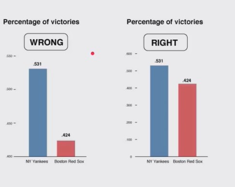

# Introduccion-al-pensamiento-probabilistico
curso de introduccion al pensamiento probabilistico de PLATZI 
## TEOREMA DE BAYES
```
         P(A) P(B|A)
 P(A|B)= ----------
           P(B)
```
Probabilidad de A (Hipotesis) dado B (evidencia)


## Garbage in, garbage out (GIGO)
Son como un tercer nivel de errores donde tenemos
- 1 Errores de sintaxis
- 2 Errores de lógica
- 3 Errores de (diseño y modelado del programa)

GIGO solo nos dice que si la calidad de nuestros datos es igual de fundamental que la precisión de nuestros computos

En otras palabras con datos errados las conclusiones serán erradas.


#### *Ejemplo*
> Los censos en su principio tenian muchisimos errores, y uno de los errores mas importantes es que se llego a la conclusión de que una persona de color que era libre tenian 10% más probabilidad de volverse locos que los esclavos. Sin embargo esto no era cierto, debido a que los censos eran incorrectos.

#### *Otro ejemplo* aporte de Juan Moreno

> Una historia común sobre muestreo es el caso de los aviones aliados en la Segunda Guerra Mundial. Lo que pasó era que veían que los aviones de combate que regresaban, usualmente tenían muchas averías e impacto de proyectiles en las alas y otras áreas. Lo que pensó la RAF fue observar donde estaban los huecos, hacer un analisis de las zonas más afectadas en sus aviones y empezar a mandar los aviones reforzados en esas zonas. ¿El problema? su muestra eran aviones que sí regresaban de combate, por lo que Abraham Wald les hizo ver que si los aviones regresaban con huecos en esas partes, era porque en esas partes los impactos no eran letales y al contrario de lo que decían los datos, había que reforzar las  partes del avión que no habian sido afectadas.

## Imagenes engañosas
Un error o metodo de engaño es:
>Extrapolar las conclusiones erroneas despues de ver una imagen.

- Cuando se juega con la escala de la grafica se puede llegar a conclusiones incorrectas.



Podemos ver que nos da una perspectiva distinta al comparar con una escala adecuada.

- **Nunca debes confiar en una gráfica sin etiquetas.**


## Cum Hoc Ergo Propter Hoc (*latin*)
Lo primero que necesitamos entender es que la correlacion entre dos variables sólo significa que ambas se mueven en el mismo sentido cuando se trata de una correlacion *positivo* o *negativa* cuando se mueven en direcciones opuestas. Pero recuerda
> Correlación no implica causalidad

La frase en latín *Cum Hoc Ergo Propter Hoc* en español significa:

*Despues de esto, eso; Entonces a consecuencia de esto, eso.*

Pero no te cases con una sola causa, piensa ***out of the box***, imagina que otras causas pueden hacer que suceda cierto hecho, para no caer en conclusiones erroneas.


 
## El prejuicio del muestreo
Aspectos importantes que seguir para el muestreo.
 - Para que un muestreo pueda servir como base para la inferencia estadistica tiene que ser:
   - **Aleatorio**
   - **Representativo.**
 - El prejuicio en el muestreo elimina la representatividad de las muestras.
 - A veces conseguir muestras es difícil, por lo que se utiliza a la población de más fácil acceso (caso estudios universitarios)

*Ejemplo*

> La mayoria piensa que los primeros seres humanos en la era de la prehistoria, siempre vivian en cavernas. Sin embargo esto no es totalmente cierto ya que no todos vivían en cavernas, sin embargo es lo que encontramos en las cuevas lo que nos ayudó a entender a esta civilización. 
Asi que podemos decir que la muestra era posiblemente aleatoria pero no era representativa.


*El error de muestreo provoca que los resultados o conclusiones puedan estar sesgados.*

## Falacia del francotirador de Texas

Esta falacia se da cuando no se toma la aletoriedad en consideración
- También sucede cuando uno se enfoca en la similitudes e ignora las diferencias
- Cuando fallamos al empezar a recolectar datos antes de generar una hipotesis estamos en alto riesgo de caer en esta falacia (muy común en Data Science)


La falacia del francotirador consiste en primero disparar y posteriormente pintar los blancos.

En otro contexto podemos decir que empezamos a obtener las muestras y despues la hipotesis se adapta a los datos recolectados, lo cual no debería ser así.

*Ejemplo*

Cuando ignoramos parte de los datos, como por ejemplo enfocarnos unicamente en las veces que le fue bien a un emprendedor e ignorar las veces que le fue mal y concluir que es un gran emprendedor porque a una le fue bien.

Evita caer en el error de ver primero los datos y concluir algo al respecto, en lugar de generar una hipotesis, recolectar muestras de manera aleatoria y representativa para posteriormente concluir adecuadamente.

## Porcentajes confusos

La mentira a través de los porcentajes puede suceder cuando:

- No sabemos la cuenta total de la cual se obtiene un porcentaje.
- No tenemos un contexto claro
- Existen porcentajes en vacío

*Ejemplo*

> ¿Cual escuela tuvo el mejor desempeño global?
> - Escuela A - incremento su rendimiento en 25%
> - Escuela B - incremento su rendimiento en 10%
> - Escuela C - incremento su rendimiento en 5% 


Ahora con contexto, ¿Cual escuela realmente alcanzó un mejor desempeño?.

|  | Rendimiento 2018 | Rendimiento 2019 | Incremento  | Incremento porcentaje |
| :---         | :---:      |  :---: |:---:      |  :---: |
| Escuela A   | 20     |  25    | 5 | 25% |
| Escuela B   | 50   | 55  | 5 | 10 % |
| Escuela C   | 95   | 100  | 5 | 5 % |

Ejemplo 2
> **¡La excusa del borracho que maneja!**
Argumentando que estadísticamente es más probable que choque si va sobrio a que si va borracho. ya que el 70% de los accidentes son por personas sobrias y el 30% por personas borrachas.


## Falacia de regresión

Esta falacia sucede cuando atribuimos efectos de causalidad a eventos que simplemente suceden por regresión a la media. 

*Ejemplo*

>Como cuando un deportista tiene su peor racha en la liga y el entrenador lo regaña o castiga para que mejore, posteriormente el deportista ya no la riega tan feo. Sin embargo esto sucede porque tiende a la media, a su juego normal, no porque el entrenador haya aplicado la medida correcta.

Esta falacia ocurre unicamente  cuando los eventos fluctuan 
